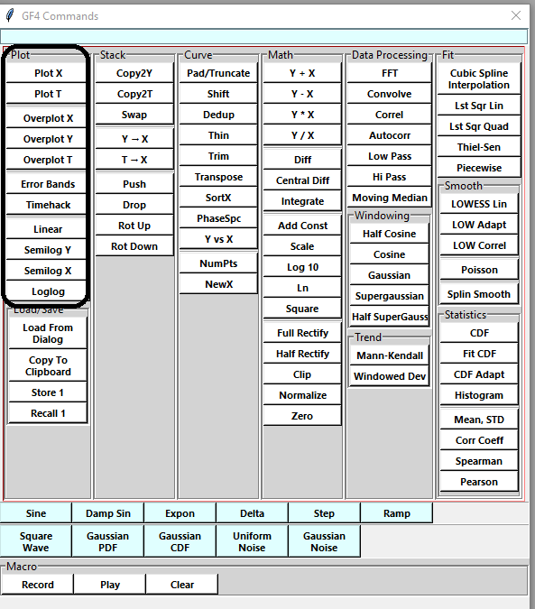

.. rst3: filename: basics

Data Format
+++++++++++

GF4 accepts text files with whitespace-separated columns, one data point per
row. It also accepts comma-separated columns (CSV files); these are converted 
internally to TAB-separated columns.  If a CSV file contains a header line before
the data rows, the header is not recognized, though it does not cause an import error.

If there is only one column, GF4 inserts an imputed first column with
values being consecutive integers beginning with 1. The "first" column becomes
the "x", or horizontal, axis. If there are more than two columns, a dialog is
displayed so the user can choose the two desired columns. The number of columns
is derived based on the first non-comment, non-blank line whose first field is a
legal floating point number.

Data fields must be numeric.  GF4 cannot make use of non-numeric data.  Data
fields are converted to floating point numbers.

Here is an example data file::

    # A comment line
    ; Another comment line.  Also, blank lines are ignored.
    # x  y
    1  1
    2  4
    3  9
    # etc 

Data points do not need to be equally spaced on the x axis.

There are specially formatted (optional) comments to specify a title, axis labels, and a break between data sets::

    ;; FIGURELABEL: The Title
    ;; XLABEL: The x axis label
    ;; YLABEL: the y axis label
    1    3.0
    2    4.0
    3    6.0
    4    7.0
    ;; ENDDATASET

The special comment key words are case sensitive.  If there is more than one dataset, the second one goes into the **Y** position in the stack, and so on up to the stack depth.  Beyond that additional data sets are ignored.

The Waveform Stack
++++++++++++++++++

The waveform stack is the primary organizing concept of GF4.  Modeled after
the stack in Hewlett-Packard RPN calculators, the stack is an array with positions
that can hold data elements.  Conceptually, the stack is arranged as a vertical 
column with a "bottom" and a "top".  Items on the stack can be "pushed" upwards,
"dropped" downwards, "rotated" and "swapped". These operations are illustrated
in the next section.

All operations that change data operate on the data in the stack bottom (the X position). All operations between two datasets, such as addition and correlation, use the X and Y positions (Y is the next position up from X);  the result of these operations only change data in the X position.

The state of the stack can be viewed by using the *Help/ Show Stack* menu item in the main window.  This opens a small window that shows the name of the dataset 
currently in each stack position. It is helpful to keep this window open while
one gains experience with GF4.  The image below depicts the stack viewer window:

.. image:: images/stack_viewer_window.png
    :scale: 50

The most common stack operations in practice are "Swap" and direct access.  The
T position is often used as a temporary data cache.

Stack Operations
****************

The stack can be "pushed", causing the existing
elements to be moved one slot "higher"::

    Stack populated with data elements A, B, and C

    |   A   |   <-- "T": stack top
    |   B   |   <-- "Y"
    |   C   |   <-- "X": stack bottom

    "Pushing" stack duplicates "X" element (top element is lost)

    |   B   |   <-- "T": stack top
    |   C   |   <-- "Y"
    |   C   |   <-- "X": stack bottom

"Dropping" the stack moves elements one slot lower::

    Stack populated with data elements A, B, and C

    |   A   |   <-- "T": stack top
    |   B   |   <-- "Y"
    |   C   |   <-- "X": stack bottom

    "Dropping" stack duplicates "T" element (bottom element is lost)

    |   A   |   <-- "T": stack top
    |   A   |   <-- "Y"
    |   B   |   <-- "X": stack bottom

The stack can also be cyclically rotated up or down::

    Stack populated with data elements A, B, and C

    |   A   |   <-- "T": stack top
    |   B   |   <-- "Y"
    |   C   |   <-- "X": stack bottom

    Rotated "up" (T -> X, X -> Y, Y -> T)

    |   B   |   <-- "T": stack top
    |   C   |   <-- "Y"
    |   A   |   <-- "X": stack bottom

    Stack populated with data elements A, B, and C

    |   A   |   <-- "T": stack top
    |   B   |   <-- "Y"
    |   C   |   <-- "X": stack bottom

    Rotated "down" (T -> Y, Y -> X, X -> T)

    |   C   |   <-- "T": stack top
    |   A   |   <-- "Y"
    |   B   |   <-- "X": stack bottom

"Swap" exchanges the X and Y data elements::

    Stack populated with data elements A, B, and C

    |   A   |   <-- "T": stack top
    |   B   |   <-- "Y"
    |   C   |   <-- "X": stack bottom

    Stack after a "Swap"

    |   A   |   <-- "T": stack top
    |   C   |   <-- "Y"
    |   B   |   <-- "X": stack bottom

Direct Access
*************

The data element in X, the stack bottom, can be copied to the Y and T positions.
The Y and T data elements can be copied to the X position.  All the stack
operations are carried out by clicking buttons in the auxiliary command window.

Non-Stack Storage
+++++++++++++++++

In addition to the stack, there are several other data storage locations:

1. A single slot accessed by the "Store 1" and "Recall 1" buttons.
These store from and retrieve to the X position.

2. The system clipboard, accessed by the "Copy To Clipboard" and "Load From Dialog"
buttons. The latter opens an editing window into which the clipboard can be
copied.

These buttons are marked in the image below:

Loading And Saving Data
+++++++++++++++++++++++

All data is saved from and loaded to the X stack position. This will overwrite
the previous contents.  If you want to keep the previous data set, push or copy 
it to one of the other positions.  Most often, the Y position is used for this.

The data format is described in :ref:`Data Format`.  Data is saved in TAB-separated
format (even if it was originally in CSV format) and includes the special comments 
that will recreate the title and axis labels.  Error bars are not saved.

Data can be saved to a file (using the *File/Save* menu item) or copied to the
system clipboard (using the *Copy To Clipboard* button).  A data file can be read
using th *File/Open* menu item.  Data, including CSV-format
data, can also be loaded into the X position from the system clipboard using the
*Load From Dialog* button.  Note that this dialog's entry panel is a basic text editor,
so the data from the clipboard can be edited before it is processed.

Saving Graphs
+++++++++++++

The visible graph can be saved as an image file, such as a .png file.  The
standard MatPlotLib toolbar that GF4 displays near the bottom of the main window
includes a button with an icon of a floppy disk.  Clicking this button opens
the image save dialog.  There is no provision for loading an image into GF4, since
it would not contain the numeric data in a form that GF4 could use.

Plotting Curves
+++++++++++++++

Plotting are grouped together in the Command Window:

    Figure BA-1. Plotting Buttons in the Command Window.

These same commands are also available in the *Plot* menu in the main GF4
window.  This menu is also the only place where the graph properties can be
changed.  These properties include line width and color, whether to use symbols
instead of lines and if so, which symbol shape to use.

Data in any of the three stack positions X, Y, and T can be plotted or overplotted.
These terms mean the following:

- Plot -- create a new graph at displays the specified data set;

- Overplot -- plot a dataset on top of an existing graph.  The axes may rescale if the new data would overflow the previous bounds of the graph.

Overplotting is essential to getting the most out of GF4, since it provides a way 
to compare several data sets, or several ways of processing the same data.

Default Plotting Settings
---------------------------
When GF4 starts up, it sets the following values for the plotting attributes:

.. csv-table:: Default Plot Settings
    :header: "Stack Position", "Color", "Line Thickness", "Line/Symbol"

    "X", black, medium, line
    "Y", cyan, medium, line
    "T", black, thin, line

These values are chosen to make it easy to distinguish between the data sets
when overplotted.  The lighter color of the medium cyan line of the Y dataset is 
easy to distingish from the medium weight black of the X dataset, while the lighter
appearance of the cyan does not distract much from the heavier weight black line.
The thin black line of the T dataset is easy to distingish from the other two.

When GF4 starts up, no stack position has data, so there is nothing to plot.
When the first data set is read, it is automatically plotted.  When other datasets
are read, GF4 notices that there is already data in the X stack position, and it
does not plot the new data.  This allows the user to keep reading data files and
overplotting them - possibly in different colors - without destroying an existing
graph.  This can be a very useful capability.

Changing Colors, Symbols, and Line Styles
*****************************************

