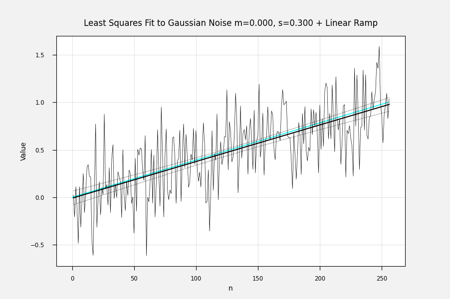

.. rst3: filename: quickstart

:tocdepth: 2

Quick Start
+++++++++++

For a quick introduction, we will work through an example. GF4 will generate the data for us. The file to launch is named gf4.pyw.  It can be launched with pythonw as a GUI application with no console, or with python to also have a console.  The console is not needed except it could display error messages, which are unlikely.  GF4 should be run with some version of python 3.6+.

To launch the program, you can double-click on its icon in the Windows Explorer file manager or the Linux equivalent, or run with python from the directory that contains gf4::

    python3 gf4.pyw

or, for systems with the "py" launcher, either of::

    pyw gf4.pyw
    py gf4.pyw

With a data file name also on the command line, GF4 will open and plot that file on launch.

The "Noisy Ramp" Example
************************

In this example, we will create a dataset that consists of a straight line with
Gaussian noise added. We will fit a line to the noisy data. Then we will display
the fitted line, and overlay the noisy data, the original line, and the error
bars for the fit.

It will be helpful to open the stack viewer window before starting.  This will
make it easier to grasp how the stack works and what data set is in which stack
position.  Open the stack viewer from the Help menu.

Create And Plot The Noisy Line
^^^^^^^^^^^^^^^^^^^^^^^^^^^^^^

**Create a Straight Line**
~~~~~~~~~~~~~~~~~~~~~~~~~~~
To generate the line, click the "Ramp" button. The line will be plotted in the left hand plotting window. this line has been placed in the bottom position of the stack, which is always called "**X**". Copy it to the "**Y**" position (the next one up in the stack) by clicking on the "Copy2Y" button in the "Stack" group.

**Create a Noise Dataset**
~~~~~~~~~~~~~~~~~~~~~~~~~~~

With the original line safely stored in **Y**, now create a dataform of noise.  Click on the "Gaussian Noise" button.  In the dialog box that pops up, change the "Sigma" value to 0.3. If we leave it at the default value of 1.0, there will be too much noise.  Even with the smaller value of sigma, there will be a lot of noise.  Accept the values by clicking the OK button or pressing the <ENTER> key.  The noise waveform will display in the plot window.

**Add The Noise To the Original Line**
~~~~~~~~~~~~~~~~~~~~~~~~~~~~~~~~~~~~~~~~

Next we will add the noise to the straight line we saved in **Y**.  In the "Math" column, click on "X + Y".  This will add the two curves together point-by-point and leave the result in the **X** stack position.  The original straight line is unchanged in **Y**.

The sum of the two datasets is a noisy line in **X**, and it has been automatically plotted in the plot window.  In one last touch, click on the "Overplot Y" button in the "Plot" column.  This will overlay the original straight line which is still in **Y**. The result is shown in Figure EX-1a.  Your result may be a little different because you will have gotten a different noise dataset.

.. figure:: images/gf4_example_1_noisy.png

    Figure EX-1a. The Noisy Ramp With Original (Clean) Curve Overlaid.

**Plot the Noisy Data With Point Symbols Instead Of Lines**
~~~~~~~~~~~~~~~~~~~~~~~~~~~~~~~~~~~~~~~~~~~~~~~~~~~~~~~~~~~~~

The Gaussian noise data points don't really form a curve because they are independent.  Perhaps it would be better to plot the noisy ramp with points instead of lines.  Try this out by using the "Plot" menu on the left-hand plot window. Select Plot/Main Marker Style/Symbol.  Then click on the "Plot" item in the "Plot" Menu or the "Plot X" button in the commands window.  Then overplot the original ramp in **Y** using the "Overplot Y" button.

The results will resemble Figure EX-1b.

.. Figure:: images/gf4_example_1_noisy_symbols.png

    Figure EX-1b. The Noisy Ramp Plotted With Symbols Instead Of Lines.

Finally, set the main marker style back to "Line"

**Save The Noisy Line For Later Viewing**
~~~~~~~~~~~~~~~~~~~~~~~~~~~~~~~~~~~~~~~~~~

For this example, at the end we will overlay this noisy line on the plot of the fitted line.  Copy it to the **T** stack position by clicking the "Copy2T" button in the "Stack" group (see `Direct Access <basics.html#direct-access>`_).

Fit and Plot The Noisy Line
^^^^^^^^^^^^^^^^^^^^^^^^^^^

To fit a linear least squares fit to the noisy ramp, click on the "Lst Sqr Lin" button in the upper right of the commands window.  The best fit straight line will plot in the plotting window.

**Overplot The Other Datasets For Comparison**
~~~~~~~~~~~~~~~~~~~~~~~~~~~~~~~~~~~~~~~~~~~~~~~~

For this example we will overplot the original ramp and the noisy version of the ramp.  These datasets are still in **Y** and **T** where we put them.

Click on the "Overplot Y" button in the "Plot" group at the left of the command window. The original straight line will be plotted in a light cyan color.  It will probably be a little different from the fitted line.  That is normal, because the noisy sample we used is unlikely to have exactly the same properties as the original.

Click on the "Overplot T" button to overplot the noisy dataset.

**Overlay Error Bands For The Fit**
~~~~~~~~~~~~~~~~~~~~~~~~~~~~~~~~~~~~

Error bands for the fit are available for most of the fitting routines.  Click the "Error Bands" button to see them.  Each time this button is clicked, the error band area gets less transparent, so you can adjust the visibility if needed.

The results are shown in Figure EX-1c.

    Figure EX-1c. The Least Squares Fitted Line With Error Bands And Original Data.

Encouraging Remarks
*******************

Examples like this are usually much harder to describe than to do.  With a little practice, these kinds of operations become familiar and they go very quickly.  One gets used to the location of the command buttons that are commonly used, and the stack positions stop feeling strange.  Just like a physical calculator, in fact.

