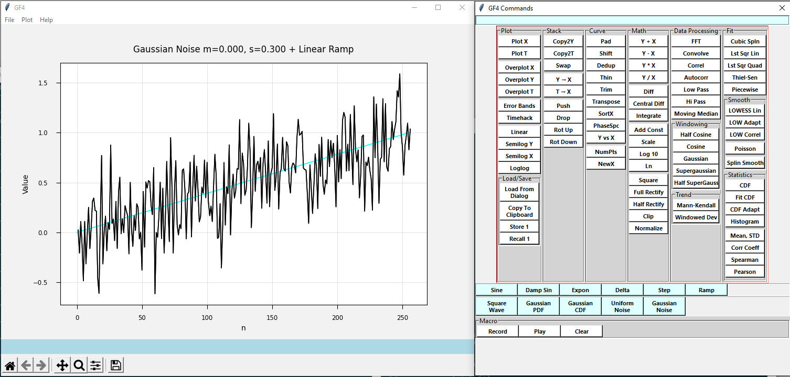

.. rst3: filename: whatis

What Is GF4?
++++++++++++

GF4 - "GF" being short for "Graphics Framework" - is a program to display
two-dimensional data, such as time series data, and to perform mathematical
operations on the data or between two related data sets. We will often call the
2D data sets "waveforms" for historical reasons, and because the data often
represents time domain waveforms. Otherwise we generally call the data by the
term "datasets". The program aims to make data exploration easy and enjoyable.

The program's interface is modeled after hand-held calculators of the "reverse
polish notation" (RPN) style. This kind of calculator was made famous by
Hewlett-Packard, starting with their HP-35 and HP-45 calculators. GF4 works with
waveforms in place of the numbers manipulated by the hand calculators.

Thus, a waveform can be scaled, squared, have its logarithm taken, integrated
and differentiated [1]_, be normalized and rectified, and so on. A discrete Fast
Fourier Transform is provided that is not limited to powers of two in data
length. Data can be trimmed or padded. Curve fitting and smoothing of several
varieties can be done. Two waveforms can be added, subtracted, multiplied, and
divided (where possible), correlated or convolved together, among others.

A certain number of basic waveforms can be generated, including a delta
function, step, ramp, sine and damped sine, Gaussian PDF and CDF distributions,
and more. Altogether there are nearly 80 different operations available.

A basic macro facility is provided to automate a sequence of repeated
operations.

Like RPN calculators, GF4 operations are organized around a stack of data sets.
Unlike those calculators, the various stack levels can be accessed directly as
well.

.. [1] That is, the discrete differencing equivalent of these operations.

Typical Screen Shot
*******************

Figure IN-1 depicts a fairly typical view of GF4 in action.  The ramp curve generator has produced a straight line, which was copied to the second stack position.  Then a Gaussian noise series was generated and added to the straight line to produce a very noisy ramp.  The underlying straight line, which still was available in its stack position, was then overlayed onto the noisy version.

Of note is the title of the graph.  It was generated automatically, capturing a description of each processing step as a reminder for the user.  This is one of many "affordances" the program provides to reduce demands on the user.  The title can be changed by clicking on it, which turns the title line into an edit box.

    Figure IN-1. Screen Shot Of GF4 In Action.

    The main plotting window is on the left, and the command window is on the right.

A Historical Note
*****************

GF4 is a fifth generation implementation of the basic waveform calculator concept (the first generation - implemented on a 64K Z-80 CP/M machine - was not named).  The implementation language has changed from FORTH to Turbo Pascal to Delphi to the current Python.  Over this time the basic concept has not been changed, while the user interface has evolved and been refined, and more math operations added.

Some Typical Uses
*****************

Typical uses of GF4 include curve fitting and observing the fit quality, comparing observed cdf curves against a gaussian of the same mean and standard distribution, smoothing noisy time series data, and creating FFT transforms to try to identify prominent frequencies in a waveform.

GF4 would make an excellent educational tool since it makes exploring the data so easy, which would help the student come to understand basic statistical limitations that are hard to convey otherwise.

The effect of zero-padding and windowing a waveform before running an FFT is quite illuminating and easy to study.  Cumulative data, such as total covid case counts vs time, can be converted into daily rates by differentiating.  This leads to a very noisy dataset, and that can be smoothed with, for example, a LOWESS smoothing routine. The study of the shape of residuals after fitting a function is interesting and easy to do.

No code need be written to perform any of these operations on datasets.

What GF4 Is Not
***************

GF4 is not a rigorous tool for statistical calculations.  Although the mathematical operations are done as carefully as possible, usually using well-established scientific libraries such as numpy and scipy, various subtleties are not taken into account.  For example, error bars can be shown for a LOWESS smooth, but they do not take into account possible autocorrelation in the dataset.  FFTs, and correlations and convolutions between waveforms, are not normalized according to usual conventions.  This generally makes no practical difference to exploratory use, since it is the relative shapes and features that are normally of interest.  In addition, although processed data sets can be saved to files, and image files of the curves seen on the screen can be saved as well, error bars, regression coefficients, and the like cannot be output.

GF4 is best used for understanding the features of a 2D dataset, and working out how effective various kinds of processing will be.  Is it too noisy or too contaminated to get useful results? Does a linear least squares fit make sense? Does this kind of a correlation seem to be meaningful? Is a smoothing window of 50 too wide?  Will a cosine or a supergaussian window produce a cleaner FFT for this particular data?  Will zero-padding the dataset improve the resolution?  Is this increase really "exponential"?  What will be the effect of a D.C offset on the FFT?

If more than this is needed, the user should take that understanding and use it with other tools to produce a more complete analysis in depth.  The "R" language might be one suitable tool, for example.  After that is done, GF4 can again be used to assess the results as a kind of quality check.

